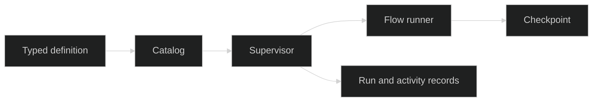

# Workflow runtime

The runtime subsection explains how a registered workflow becomes a durable, session-owned execution. Start with the [Workflows overview](/docs/guides/workflows), then choose the page that matches the seam you are implementing.

## Runtime boundary

The [definition page](/docs/guides/workflows/workflow-runtime/definitions) covers the typed contract and catalog lookup. The [supervisor page](/docs/guides/workflows/workflow-runtime/runtime) covers activation, leases, workers, start acknowledgement, and shutdown. The [state and history page](/docs/guides/workflows/workflow-runtime/state-and-history) explains which durable record owns each fact. The [interruption and resume page](/docs/guides/workflows/workflow-runtime/interruption-and-resume) covers checkpoint adoption and validated continuation input. The [lifecycle page](/docs/guides/workflows/workflow-runtime/lifecycle) covers statuses, cancellation, and failure.

## Choose the runtime page

| If you need to... | Read |
| --- | --- |
| Define and register a versioned workflow | [Definitions and schemas](/docs/guides/workflows/workflow-runtime/definitions) |
| Start or stop session-owned execution | [Runtime and supervisors](/docs/guides/workflows/workflow-runtime/runtime) |
| Separate graph state from run metadata and activity | [State, checkpoints, and history](/docs/guides/workflows/workflow-runtime/state-and-history) |
| Recover, interrupt, or resume a run | [Interruption, resume, and recovery](/docs/guides/workflows/workflow-runtime/interruption-and-resume) |
| Interpret status transitions or cancellation | [Statuses, cancellation, and failure](/docs/guides/workflows/workflow-runtime/lifecycle) |

For graph construction and graph-level interrupts, use the [Flow graph composition guide](/docs/guides/workflows/flow). For tool exposure and Harness registration, use the [Workflow tools subsection](/docs/guides/workflows/workflow-tools).

## Source

- [Supervisor implementation](https://github.com/looprig/workflows/blob/main/supervisor.go)

## Proof

- [Supervisor recovery tests](https://github.com/looprig/workflows/blob/main/supervisor_test.go)
