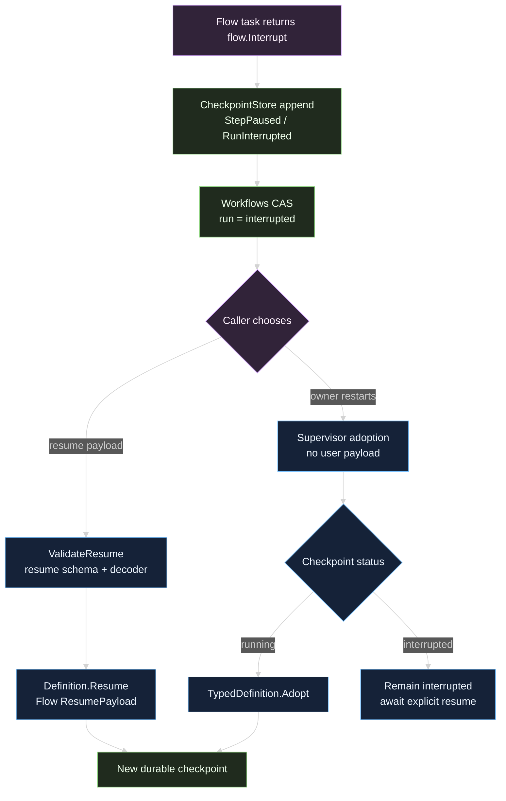

# Interruption, resume, and recovery

An interrupted workflow is waiting, not failed. Flow records a paused checkpoint, Workflows maps that outcome to `RunInterrupted`, and a caller chooses whether and how to resume. A supervisor restart may adopt a durable running checkpoint, but it never invents a user resume payload for an interrupted one.

## Two kinds of continuation input

Flow provides two distinct serialization boundaries:

| Value | Set by | Persisted? | Read by |
| --- | --- | --- | --- |
| Resume payload | The caller of `Runner.Resume` and Workflows `Resume` | No, it is supplied for this continuation | `flow.ResumePayload[T]` with context |
| Stateful continuation | The task's `flow.StatefulInterrupt` call | Yes, in the interrupt record | `flow.InterruptState[T]` with context |

Use a resume payload for new user input, such as an approval decision or a value needed to continue. Use a stateful continuation when the task itself must preserve a small typed cursor across a restart. Both should be bounded and safe to serialize. The Workflows resume schema validates the user payload before it reaches Flow; Flow validates and decodes the stored checkpoint before it runs any task.

## Interrupt from a task

`flow.Interrupt` returns an error that the Flow coordinator recognizes as an awaiting pause. The task does not need to mutate the graph state before returning. `flow.StatefulInterrupt` additionally carries a continuation value that Flow stores as JSON.

```go
type approval struct {
	Approved bool `json:"approved"`
}

type taskCursor struct {
	DocumentIndex int `json:"document_index"`
}

func review(ctx context.Context, document string) (string, error) {
	decision, ok := flow.ResumePayload[approval](ctx)
	if !ok {
		// The first execution pauses and leaves a durable request for approval.
		return "", flow.StatefulInterrupt(ctx,
			"approval required for "+document,
			taskCursor{DocumentIndex: 1},
		)
	}
	if !decision.Approved {
		return "rejected", nil
	}
	return "approved", nil
}
```

On a later continuation, a task may also read the persisted cursor:

```go
cursor, restored := flow.InterruptState[taskCursor](ctx)
if restored {
	// Continue from cursor.DocumentIndex rather than starting the side effect over.
	_ = cursor
}
```

The `info` value appears in the live `flow.Interruption` result and in the durable checkpoint boundary. It is not automatically a safe public event. Workflows activity projection emits only bounded milestone text and IDs.

## Validate and resume through Workflows

Definitions with a nonempty resume schema must provide a resume decoder. The typed path is:

```go
resume, err := definition.ValidateResume(
	json.RawMessage(`{"approved":true}`),
)
if err != nil {
	// InvalidInputError identifies the resume boundary and preserves the cause.
	return err
}
result, err := definition.Resume(ctx, graphRunID, resume)
if err != nil {
	return err
}
fmt.Println(result.Run.Status, result.Summary)
```

The supervisor and tool path add the session boundary. `Supervisor.Resume` loads the registry run, requires `RunInterrupted`, resolves the exact definition version, validates the canonical JSON object, transitions the registry to `running`, and calls the definition's `Resume`. `workflow_run_resume` performs the same validation before invoking the supervisor.

The continuation path is:



## Checkpoint validation protects resume

Before Flow runs a task during `Resume`, it validates the loaded checkpoint against:

- the requested `GraphRunID`;
- the compiled graph's stable `GraphID`;
- the compiled graph's `GraphVersion` fingerprint;
- terminal status rules, decoded state, vertex identities, and phase consistency.

A changed graph returns `*flow.GraphVersionMismatchError`. A checkpoint belonging to another run returns `*flow.GraphRunMismatchError`. A completed or cancelled Flow run returns `*flow.ResumeTerminalError`. Workflows wraps definite checkpoint read problems as a failed run when the supervisor can still own the session. These checks happen before business tasks execute.

The repository's stage example demonstrates the full lifecycle: start into an interrupt, rebuild the definition against the same checkpoint store, call `Get`, validate a typed resume payload, resume to completion, cancel another run, and inspect contiguous history. See [Flow graph composition](/docs/guides/workflows/flow) for the graph and [Workflow state, checkpoints, and history](/docs/guides/workflows/workflow-runtime/state-and-history) for the storage split.

## Source

- [typed_definition.go](https://github.com/looprig/workflows/blob/main/typed_definition.go)

## Proof

- [examples/docs/stage18_workflows/main_test.go](https://github.com/looprig/workflows/blob/main/examples/docs/stage18_workflows/main_test.go)
