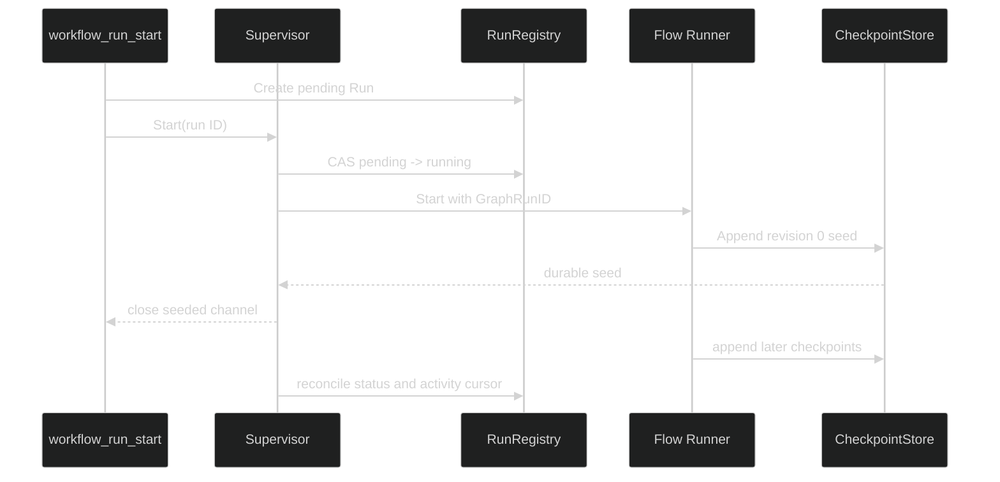

# Workflow runtime and supervisors

`Supervisor` is the session boundary around registered definitions. It owns one session lease, coordinates run controllers, and joins Workflows registry state to the Flow checkpoint truth. A process may construct definitions and registries before a live session exists, but execution begins only after `Activate` has bound the supervisor to Harness session services.

## Construct, activate, and shut down

`NewSupervisor` requires a nonzero `SessionID`, a `Catalog`, a `RunRegistry`, an `InputStore`, and a `storage.Leaser`. It defaults to a UTC clock, a five-second shutdown timeout, and four workers. `MaxWorkers` must be between 1 and 64.

`Activate(ctx, services)` does the following in order:

1. Validate the late-bound `tool.SessionResourceServices` value.
2. Acquire the session ownership lease.
3. Store the owner context and workflow activity publisher.
4. Start watching for lease loss.
5. List existing runs and schedule reconciliation for nonterminal records.

Activation is single-owner. A second active supervisor receives `ErrSupervisorActive`; a closed supervisor receives `ErrSupervisorClosed`. If loading existing runs fails, activation releases the lease and returns to the inactive state.

`Shutdown` stops accepting work, cancels the owner context, waits for worker completion within the configured timeout, releases the lease, and waits for the lease watcher. A timeout is reported as `ErrShutdownTimeout`. Callers should still treat the supervisor as closed after shutdown.

```go
// The Harness process creates the publishers and leaser. Workflows only needs
// their interfaces, so a storage backend can change without changing the run
// controller.
supervisor, err := workflows.NewSupervisor(workflows.SupervisorConfig{
	SessionID:       sessionID,
	Catalog:         catalog,
	Registry:        registry,
	Inputs:          inputs,
	Leaser:          leaser,
	ShutdownTimeout: 5 * time.Second,
	MaxWorkers:      4,
})
if err != nil {
	return err
}

services, err := tool.NewSessionResourceServices(
	processLifecyclePublisher,
	processCompletionNotifier,
	workflowActivityPublisher,
)
if err != nil {
	return err
}
if err := supervisor.Activate(ctx, services); err != nil {
	return err
}
defer supervisor.Shutdown(context.Background())
```

The service set is described in [Harness integration](/docs/guides/workflows/workflow-tools/harness-integration). The surrounding session lifecycle and tool registration are documented in the [Harness module reference](/docs/modules/harness).

## Start is durable before it is asynchronous

`Supervisor.Start(ctx, runID)` returns three values: a channel that closes after the Flow run has written its durable seed, a channel for a definite scheduling or start error, and an immediate error for a rejected request. The worker continues toward interruption or completion after the seed acknowledgement. This lets a caller report a real run ID and initial status without waiting for the graph to finish.

The normal sequence is:



The start worker checks that the registry record is still `pending`, resolves the exact definition name and version, validates and loads the private input reference, transitions the record to `running`, and calls `Definition.Start` with `flow.WithGraphRunID`. If ownership is lost while the graph is executing, the worker stops making session-owned writes and lets the next owner adopt the checkpoint.

## Restart adoption

Activation lists runs by session. Completed and cancelled records are not restarted. Pending, running, interrupted, and failed records are attached to a controller and reconciled. The controller reads the Flow history before deciding what to do:

| Registry status | Checkpoint observation | Action |
| --- | --- | --- |
| `pending` | No checkpoint | Start the graph |
| `pending` | Existing checkpoint | Promote through `running`, then adopt |
| `running` | Running checkpoint | Call the typed definition's `Adopt` capability when available |
| `running` or `interrupted` | Completed or cancelled checkpoint | Repair the registry from checkpoint truth |
| Any active status | Definite missing, corrupt, or mismatched checkpoint | Mark the registry run `failed` |
| `failed` | History available or intentionally absent | Reconcile the bounded failure activity only |

`Adopt` is not a user resume. It carries no resume payload and is used only to continue a durable running Flow checkpoint after a supervisor restart. An interrupted checkpoint still needs an explicit `Resume` call with a definition-validated payload. That distinction prevents an owner restart from inventing user intent.

## Operational controls

The supervisor exposes focused controls:

| Method | Behavior |
| --- | --- |
| `Start(ctx, runID)` | Schedule a pending run and wait only for the durable seed acknowledgement |
| `Resume(ctx, runID, payload)` | Require an interrupted run, validate the payload through its definition, and continue Flow |
| `Cancel(ctx, runID, reason)` | Persist cancellation intent, interrupt in-flight execution, and reconcile the terminal checkpoint |
| `History(ctx, runID, afterRevision, afterEventID, limit)` | Project bounded activity metadata from durable checkpoint history |
| `WaitIdle(ctx)` | Wait for scheduled work, then return the first recorded worker error |
| `LastError()` | Read the first worker error retained by the supervisor |
| `Shutdown(ctx)` | Stop work, release ownership, and report timeout or release failure |

`WaitIdle` does not mean that a run is completed. It means the supervisor has no currently scheduled workers. A long-lived supervisor may schedule more work after the call.

## Source

- [supervisor.go](https://github.com/looprig/workflows/blob/v0.1.2/supervisor.go)

## Proof

- [supervisor_test.go](https://github.com/looprig/workflows/blob/v0.1.2/supervisor_test.go)
