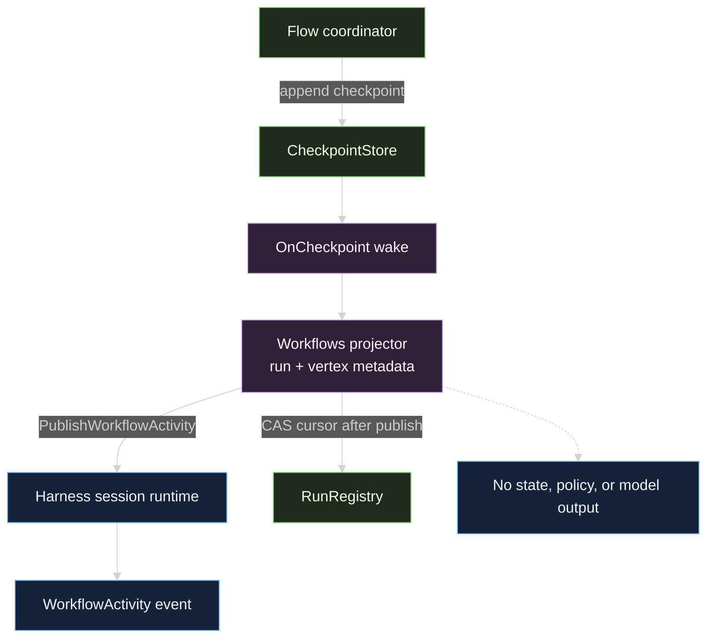

# Harness integration

Workflows integrates with Harness through two narrow seams:

1. `Supervisor` implements `tool.SessionResource`, so a session owns activation, lease lifetime, run controllers, and shutdown.
2. Harness supplies a `tool.WorkflowActivityPublisher`, so Workflows can publish a safe projection after a Flow checkpoint is durable.

The supervisor does not import a concrete event hub, model provider, or tool runner. The service interfaces keep the runtime composable with the [Harness module](/docs/modules/harness), [Tools module](/docs/modules/tools), [Inference module](/docs/modules/inference), and [Flow module](/docs/modules/flow).

## Session resource lifecycle

Harness's `tool.SessionResource` contract is:

```go
type SessionResource interface {
	Activate(context.Context, SessionResourceServices) error
	Shutdown(context.Context) error
}
```

`Supervisor.Activate` requires a validated `SessionResourceServices` value. The service set contains a process lifecycle publisher, a process completion notifier, and a workflow activity publisher. Workflows uses the third service directly and validates the whole set so the session resource cannot be activated with a partial late-bound service graph.

```go
services, err := tool.NewSessionResourceServices(
	processLifecyclePublisher,
	processCompletionNotifier,
	workflowActivityPublisher,
)
if err != nil {
	return err
}

resource, err := resourceRegistry.GetOrCreate(ctx, "workflow-runtime", func(_ string) (tool.SessionResource, error) {
	return supervisor, nil
})
if err != nil {
	return err
}
if err := resource.Activate(ctx, services); err != nil {
	return err
}
defer resource.Shutdown(context.Background())
```

The registry factory is responsible for resolving the session-owned instance. `Supervisor.SessionID` exposes the immutable owner so composition code can reject a resource or tool bundle created for another session before it is registered.

## Activity is projected after durability

Workflows wires a Flow `OnCheckpoint` wake-up, but it does not publish from a vertex completion callback. The callback may run before the checkpoint is durable. Instead, the supervisor serializes reconciliation with the run controller, loads the complete checkpoint history, projects bounded metadata, publishes each activity, and advances `Run.ActivityCursor` only after the publisher returns nil.



The transport-neutral DTO is `tool.WorkflowActivityMetadata`:

```go
type WorkflowActivityMetadata struct {
	EventID           uuid.UUID
	SessionID         uuid.UUID
	RunID             uuid.UUID
	WorkflowName      string
	WorkflowVersion   string
	Kind              string
	Status            string
	VertexID          uuid.UUID
	VertexLabel       string
	CompletedVertices uint32
	TotalVertices     uint32
	Message           string
	OccurredAt        time.Time
}
```

The publisher and event layer enforce bounded names, versions, labels, messages, progress, and timestamps. Workflows also strips control characters and caps activity text before publication. `EventID` is deterministic for a run activity, so retrying a publication does not create a fresh logical milestone.

## Activity vocabulary and event consumers

The activity kinds are `run_started`, `vertex_completed`, `run_interrupted`, `run_resumed`, `run_completed`, `run_cancelled`, and `run_failed`. Their status field is the Workflows projection: `running`, `interrupted`, `completed`, `cancelled`, or `failed`.

Harness converts the DTO into its sealed `WorkflowActivity` event. A consumer should use the activity event for a user-facing timeline and `workflow_run_get` for current metadata. It should not infer the full Flow frontier from activity count. Parallel vertices may finish in a different order, which is why stable vertex IDs in `NewVertexMetadataForID` matter.

For event envelopes and workflow event visibility, read [Harness workflow events](/docs/guides/harness/events/process-and-workflow). For how a model receives the workflow tools, read [Inference tool requests](/docs/guides/inference/requests/tools). For model request selection inside a surrounding turn, read [Harness model requests](/docs/guides/harness/step/model-request).

## Source

- [session_resource.go](https://github.com/looprig/workflows/blob/main/session_resource.go)

## Proof

- [harness_restore_integration_test.go](https://github.com/looprig/workflows/blob/main/harness_restore_integration_test.go)
