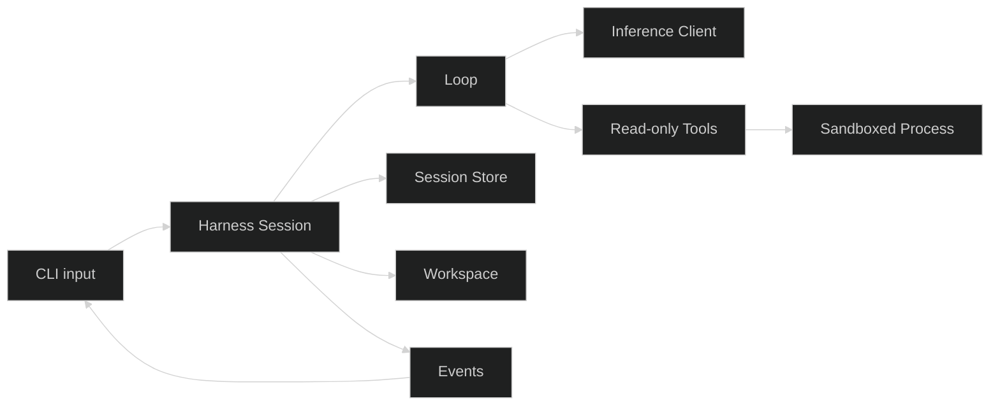

# Build a coding assistant

This tutorial builds a coding assistant that can answer a question, inspect files through declared tools, keep a resumable session, work inside a session-owned directory, and confine process tools. The final runtime is independent of its presentation, so you can keep the CLI or attach the TUI, Web UI, ACP, or MCP later.

## What you will build

The tutorial uses one project named `looprig-coding-assistant`. Each page adds one boundary without changing the responsibilities added earlier.

## How the pieces fit

| Module | Responsibility in the assistant | Added when |
| --- | --- | --- |
| Core and Inference | Messages, model identity, requests, responses, and streaming | First model call |
| LLM | OpenAI, Anthropic, Ollama, and other provider clients | Model configuration |
| Harness | Loop, Rig, Session, commands, events, tools, and shutdown | Agent runtime |
| Tools | Read, search, edit, process, interaction, and delegation definitions | Tool registration |
| Fsstore and Storage | Durable session history and workspace snapshots | Persistence |
| Sandbox | Native confinement for child processes | Process execution |
| TUI or Client | Terminal and framework-neutral browser presentation | Interface selection |

You do not need to adopt the full stack at once. Inference is useful by itself. Harness becomes useful when you need a live agent runtime. Storage, Sandbox, protocols, workflows, and interfaces remain optional composition boundaries.

## Tutorial path

1. [Create the Go project](/docs/start/installation/).
2. [Connect a model with Inference](/docs/start/model-call/).
3. [Run the agent with Harness](/docs/start/first-run/).
4. [Add read-only tools and gates](/docs/start/tools-and-gates/).
5. [Persist and restore sessions](/docs/start/sessions/).
6. [Add a session workspace](/docs/start/workspaces/).
7. [Sandbox process tools](/docs/start/sandbox-and-interfaces/).
8. [Run the coding assistant CLI](/docs/start/run-cli/).
9. [Choose an interface and extend the agent](/docs/start/next-steps/).

Start with the project directory. You will have a working model call before introducing Harness.
