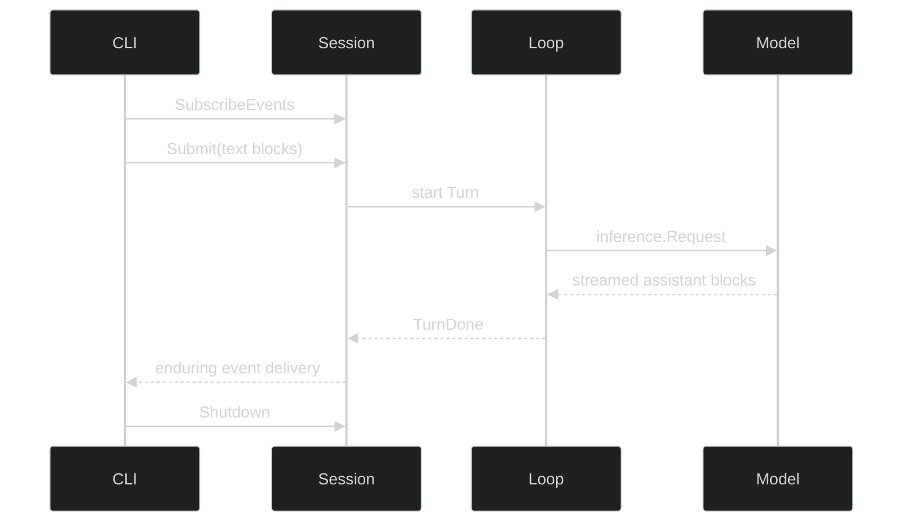

# Run the agent with Harness

Harness turns the model boundary into a stateful agent runtime. A `Loop` freezes one agent definition. A `Rig` combines loops with runtime services. A `Session` owns live turns, events, resources, and shutdown.

## Define the Loop

Create `agent.go` and pass in the client and model created on the previous page:

```go
func defineAssistant(client inference.Client, selected model.Model) (loop.Definition, error) {
	return loop.Define(
		loop.WithName("coding-assistant"),
		loop.WithSystem("Inspect evidence before answering. Never claim a file was read unless a tool returned it."),
		// Harness receives the provider-neutral client and its matching model.
		loop.WithInference(client, selected),
	)
}
```

The Loop is configuration, not a live goroutine. System instructions, tools, modes, gates, context policy, delegates, and model selection belong here because they define the agent that a session will run.

## Assemble the Rig

Start with an in-memory session store while learning the lifecycle:

```go
func defineRuntime(assistant loop.Definition) (*rig.Rig, error) {
	store, err := sessionstore.Open(memstore.New())
	if err != nil {
		return nil, err
	}
	return rig.Define(
		rig.WithLoops(assistant),
		// Primers are Loops that a new session may start with.
		rig.WithPrimers("coding-assistant"),
		rig.WithSessionStore(store),
	)
}
```

The Rig owns immutable topology and shared services. The next pages replace memory storage and add a workspace without changing the Session-facing code.

## Run a Session

Subscribe before submitting so a fast terminal event cannot pass before the CLI is listening:

```go
func runTurn(ctx context.Context, runtime *rig.Rig, question string) error {
	live, err := runtime.NewSession(ctx)
	if err != nil {
		return err
	}
	defer live.Shutdown(context.Background())

	events, err := live.SubscribeEvents(event.EventFilter{
		Enduring: event.LoopScope{All: true},
	})
	if err != nil {
		return err
	}
	defer events.Close()

	_, err = live.Submit(ctx, []content.Block{
		&content.TextBlock{Text: question},
	})
	if err != nil {
		return err
	}

	for delivery := range events.Events() {
		if done, ok := delivery.Event.(event.TurnDone); ok {
			fmt.Println(responseText(&inference.Response{Message: done.Message}))
			return nil
		}
	}
	return events.Err()
}
```

`Submit` returns a correlation ID. Output arrives as events because one turn can stream tokens, request tools, pause at a gate, accept queued input, or terminate with an error.

## Runtime sequence



Read [Harness commands](/docs/guides/harness/commands/), [events](/docs/guides/harness/events/), [Step](/docs/guides/harness/step/), [Turn](/docs/guides/harness/turn/), [Loop](/docs/guides/harness/loop/), and [Rig](/docs/guides/harness/rig/) for the full lifecycle.

## Runnable checkpoint

Run or copy the [complete commented Harness quickstart](https://github.com/looprig/.github/blob/main/examples/go/guides/harness-quickstart/main.go). Its [exact-output test](https://github.com/looprig/.github/blob/main/examples/go/guides/harness-quickstart/main_test.go) proves the session reaches `TurnDone` and shuts down. The fixture uses a deterministic client; your coding assistant supplies the production client from `model.go`.

Continue to [add read-only tools and gates](/docs/start/tools-and-gates/).
